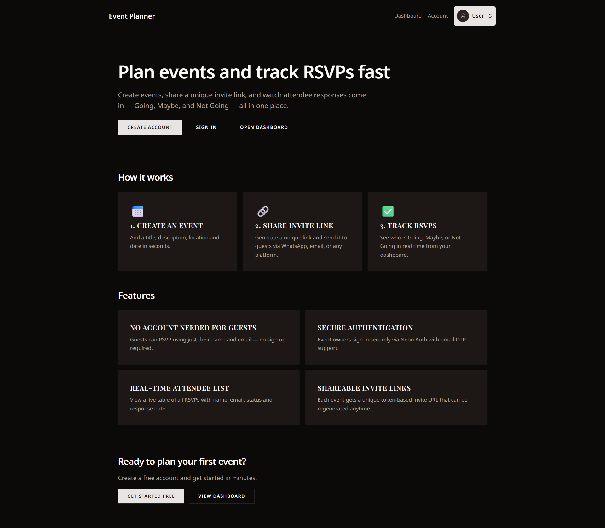
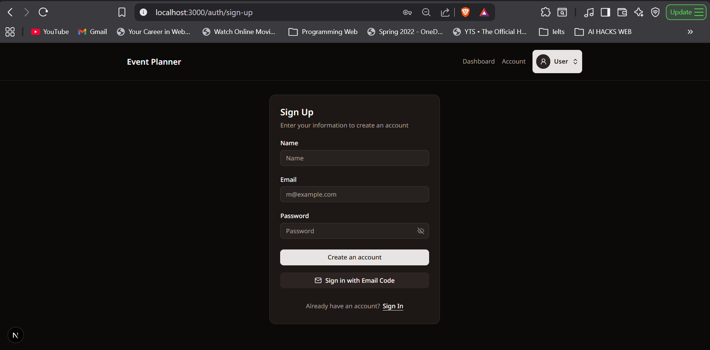
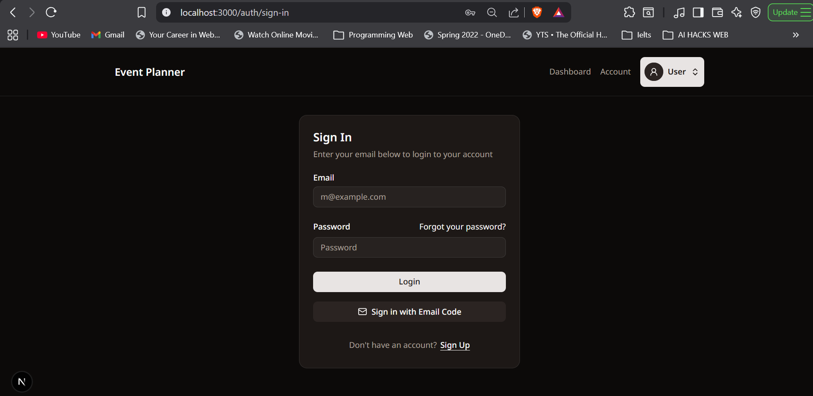
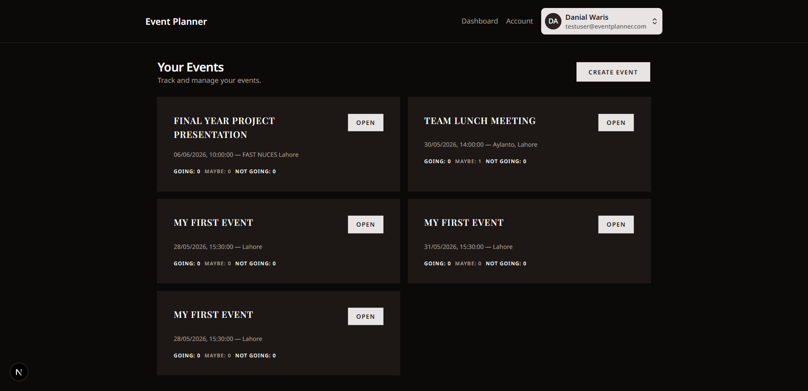
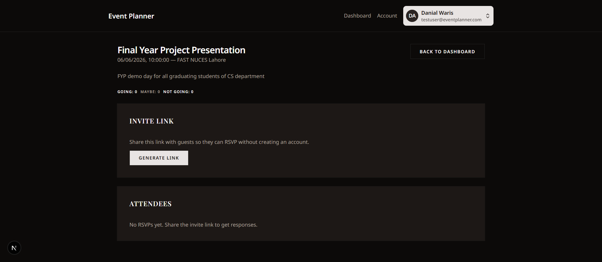
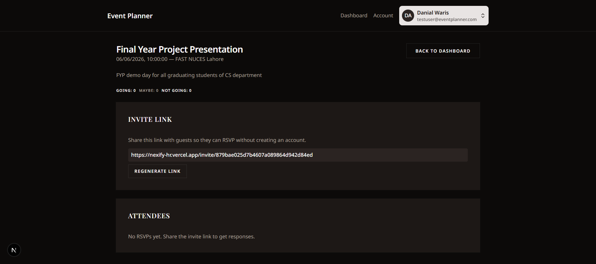
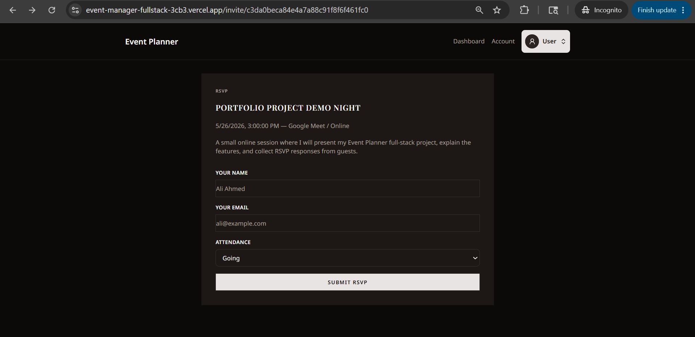
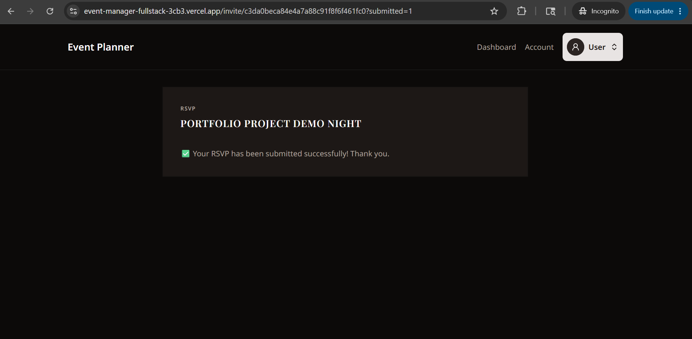
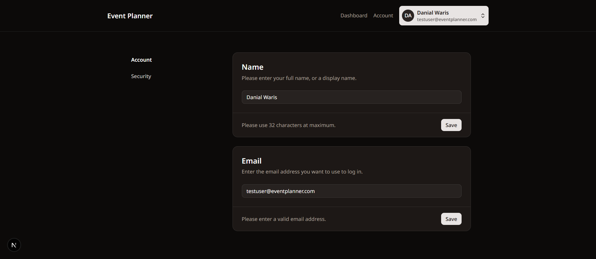

# Event Planner App

A full-stack event management web application built with **Next.js**, **TypeScript**, **Neon PostgreSQL**, **Prisma**, **Tailwind CSS**, **shadcn/ui**, and **Neon Auth**.

The app allows authenticated users to create events, generate public invite links, collect guest RSVPs, and track attendee responses from a dashboard.

## Live Demo

https://event-manager-fullstack-3cb3.vercel.app

## GitHub Repository

https://github.com/muneeb123469/event-manager-fullstack

---

## Features

- User authentication with Neon Auth
- Protected dashboard for authenticated users
- Create events with title, description, location, and date/time
- Generate unique public invite links for each event
- Guests can RSVP without creating an account
- RSVP options: Going, Maybe, Not Going
- Event owner can view RSVP counts
- Attendee table with guest name, email, status, and response date
- Account settings page
- Responsive UI built with Tailwind CSS and shadcn/ui
- Deployed on Vercel with Neon PostgreSQL database

---

## Tech Stack

| Technology            | Purpose                                  |
| --------------------- | ---------------------------------------- |
| Next.js 16 App Router | Full-stack React framework               |
| TypeScript            | Type-safe application development        |
| Tailwind CSS          | Utility-first styling                    |
| shadcn/ui             | Reusable UI components                   |
| Neon PostgreSQL       | Managed cloud database                   |
| Prisma ORM            | Database schema, migrations, and queries |
| Neon Auth             | Authentication and session management    |
| Vercel                | Hosting and deployment                   |

---

## How It Works

1. A user signs up or logs in using Neon Auth.
2. The authenticated user opens the dashboard.
3. The user creates an event.
4. The app stores the event in Neon PostgreSQL using Prisma.
5. The user generates a unique invite link.
6. Guests open the invite link without logging in.
7. Guests submit RSVP responses.
8. The event owner can view RSVP counts and attendee details on the event page.

---

## Project Structure

```txt
app/
  account/              Account settings pages
  api/auth/             Neon Auth API route
  auth/                 Sign in and sign up pages
  dashboard/            Protected dashboard page
  events/               Event creation and event detail pages
  invite/               Public RSVP pages
  generated/prisma/     Generated Prisma client files

components/
  ui/                   shadcn/ui components

lib/
  actions/              Server actions for events and RSVPs
  auth/                 Neon Auth client/server setup
  prisma.ts             Prisma client instance
  utils.ts              Utility functions

prisma/
  schema.prisma         Database schema
```

---

## Database Models

### Event

Stores event details such as title, description, location, date, owner user ID, and timestamps.

### EventInvite

Stores the unique invite token connected to an event.

### EventRsvp

Stores guest RSVP information including name, email, attendance status, and response date.

---

## Environment Variables

Create a `.env` file in the root directory:

```env
DATABASE_URL="your_neon_database_connection_string"
NEON_AUTH_BASE_URL="your_neon_auth_base_url"
NEON_AUTH_COOKIE_SECRET="your_32_character_or_longer_secret"
NEXT_PUBLIC_APP_URL="http://localhost:3000"
```

For production on Vercel:

```env
NEXT_PUBLIC_APP_URL="https://event-manager-fullstack-3cb3.vercel.app"
```

Never commit your `.env` file to GitHub.

---

## Getting Started Locally

### 1. Clone the repository

```bash
git clone https://github.com/muneeb123469/event-manager-fullstack.git
cd event-manager-fullstack
```

### 2. Install dependencies

```bash
npm install
```

### 3. Generate Prisma Client

```bash
npx prisma generate
```

### 4. Run database migrations

```bash
npx prisma migrate dev
```

### 5. Start the development server

```bash
npm run dev
```

Open the app:

```txt
http://localhost:3000
```

---

## Deployment

The project is deployed using:

- **Vercel** for hosting the Next.js application
- **Neon** for PostgreSQL database and authentication
- **GitHub** for version control

Important production environment variables must be added in Vercel before deployment.

---

## Screenshots

### Landing Page



### Sign Up



### Sign In



### Dashboard



### Event Detail Page



### Invite Link Generation



### Public Invite Page



### RSVP Success



### Account Settings



## Future Improvements

- Add event editing and deletion
- Add email invitations
- Add search and filtering for events
- Add RSVP analytics charts
- Add loading states and better error handling
- Add user profile customization

---

## Author

**Muneeb Ahmad**

GitHub: https://github.com/muneeb123469

---

## License

This project is open-source and available under the MIT License.
